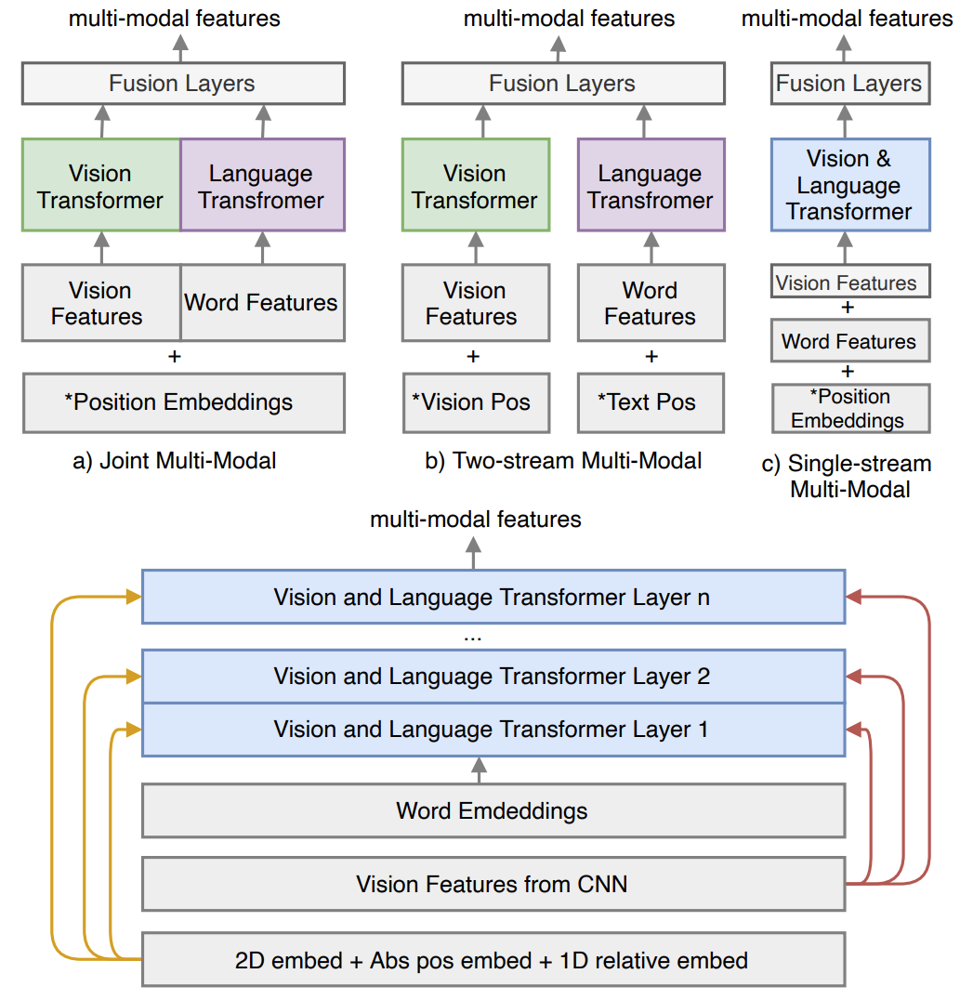

# DocFormer Model Training 

## Dependencies

Make sure you have the necessary libraries installed. Typically, include instructions for libraries like TensorFlow, PyTorch, OpenCV, etc., depending on your project's requirements.

```bash
pip install -r requirements.txt
```

---

## Dataset Preparation

This document outlines the necessary steps and requirements for preparing the dataset used in the classification task. Please follow the instructions carefully to ensure a smooth setup.
 ### Required Changes in `docformer/constants.py`

### Directory Structure

- **Base Directory**:  
  `/home/ntlpt19/Downloads/Classification_final_training/V2_ROOT/LC`
  
- **Split OCR Files**:  
  `/home/ntlpt19/Downloads/Classification_final_training/V4_ROOT/LC/ocr_chunks`
  
- **Training Data CSV**:  
  `/home/ntlpt19/Downloads/Classification_final_training/V4_ROOT/LC/training_set_1.csv`
  
- **Testing Data CSV**:  
  `/home/ntlpt19/Downloads/Classification_final_training/V4_ROOT/LC/testing_set_1.csv`
  
- **Output Folder for Debugging**:  
  `/home/ntlpt19/Downloads/Classification_final_training/debug`
  
- **OCR Directory**:  
  `/home/ntlpt19/Downloads/Classification_final_training/OCR_GV`
  
- **Pytesseract Output Folder**:  
  `/home/ntlpt19/Downloads/Classification_final_training/V4_ROOT/LC/ocr_pytess`


If you intend to use a custom split for your data, please make the following changes in the `constants.py` file:

```python
train_data_csv = '/home/ntlpt19/Downloads/Classification_final_training/V4_ROOT/LC/training_set_1.csv'
test_data_csv = '/home/ntlpt19/Downloads/Classification_final_training/V4_ROOT/LC/testing_set_1.csv'
custom_label2id = {'PO': 0, 'PI': 1, 'OTHERS': 2}
custom_split = True
```

### Note:

- **OCR Processing**: It is essential that the Optical Character Recognition (OCR) processing is completed **prior to** proceeding with data classification. If OCR is not done beforehand, you will need to generate and save OCR outputs in a separate folder using Pytesseract.

## Debug Mode

To facilitate debugging, ensure `debug_mode` is set to `True` in your configuration. This will provide more insights during the processing of the dataset.

---


## Updating `src/docformer/dataset.py`

Make sure to update the following paths in the `src/docformer/dataset.py` file to ensure proper handling of your dataset:

```python
out_fol = '/home/ntlpt19/Downloads/Classification_final_training/debug'
ocr_gv = '/home/ntlpt19/Downloads/Classification_final_training/OCR_GV'
split_ocr_folder = '/home/ntlpt19/Downloads/Classification_final_training/V4_ROOT/LC/eval/ocr_chunk'
ocr_pytess = '/home/ntlpt19/Downloads/Classification_final_training/V4_ROOT/LC/eval/pytesseract_ocr'
ocr_gv_json = '/home/ntlpt19/Downloads/Classification_final_training/V4_ROOT/LC/EVL_OCR'
debug_mode = False  # Set to True for debugging insights
```


## Training Procedures

Here are the different training procedures available for this classification task:

1. **Training with Previously Trained Model**:  
   To fine-tune a model using the existing Docformer model tained with same configuration, use the following script:  
   `/docformer/training_finetuining_using_premodel.py`

2. **Training from Scratch**:  
   To train the model from scratch using a loaded model based on the configuration, use:  
   `/docformer/train_main.py`  
   **Note**: For language embeddings, we are using LayoutLM version 1 language embedding weights.

3. **Chunk-Wise Training**:  
   To train the model chunk-wise, where the data is split into chunks based on a threshold (set to 250), use:  
   `/docformer/train_main_chunk_wise.py`

### Label Mapping for Inference

During training, the following files will be generated:

- **Modeling Label to ID Mapping**:  
  The mapping of labels to IDs will be saved in a file named `modeling_label2id.txt`. 
### Using `modeling_label2id.txt` for Inference

At the time of inference, you will need to read the `modeling_label2id.txt` file to set up the mappings for inference as follows:

```python
label2id_infer = {}
id2label_infer = {}

# Example of how to populate the dictionaries
label2id_infer = {'PO': 0, 'PI': 1, 'OTHERS': 2}
id2label_infer = {0: 'PO', 1: 'PI', 2: 'OTHERS'}
```

Ensure that these mappings are correctly populated based on the contents of `modeling_label2id.txt`.


## Generating Results

To generate results for a set of images, you can use the following script:

- **Generate Inference Results**:  
  To generate the results from a set of images, run:  
  `/docformer/inference_res.py`
  or run for chunk wise analysis:
  `/docformer/inference_chunk_wise.py`

## Generating Accuracy and Recall

To evaluate the performance of your model, use the following scripts:

1. **Generate Accuracy and Recall**:  
   To calculate accuracy and recall for the classification, use:  
   `/docformer/accuracy_generate.py`

2. **Generate Only Recall**:  
   If you want to generate only the recall metric, use:  
   `docformer/accuracy_gen_only_recall.py`

### Implementation Results
The following tables summarize the classification scores for different models across specific epochs. **Note:** The given scores are generated on evaluation data.

| Class   |DocFormer Score | LayoutLM Score | Training Count | Evaluation Count |
|---------|----------------|----------------|----------------|------------------|
| OTHERS  | 0.73           | 0.90           | 2771           | 109              |
| PI      | 0.88           | 0.88           | 371            | 50               |
| PO      | 0.83           | 0.97           | 915            | 150              |
| **OVERALL** | **0.8133**   | **0.92**       | -              | -                |


# Main Paper
# DocFormer - PyTorch



Implementation of [DocFormer: End-to-End Transformer for Document Understanding](https://arxiv.org/abs/2106.11539), a multi-modal transformer based architecture for the task of Visual Document Understanding (VDU) 📄📄📄.

DocFormer is a multi-modal transformer based architecture for the task of Visual Document Understanding (VDU). In addition, DocFormer is pre-trained in an unsupervised fashion using carefully designed tasks which encourage multi-modal interaction. DocFormer uses text, vision and spatial features and combines them using a novel multi-modal self-attention layer. DocFormer also shares learned spatial embeddings across modalities which makes it easy for the model to correlate text to visual tokens and vice versa. DocFormer is evaluated on 4 different datasets each with strong baselines. DocFormer achieves state-of-the-art results on all of them, sometimes beating models 4x its size (in no. of parameters).

The official implementation was not released by the authors.

## NOTE:

I tried to pre-train DocFormer on the task of MLM on a subset of [IDL Dataset](https://github.com/furkanbiten/idl_data). The weights are [here](https://www.kaggle.com/code/akarshu121/downloading-docformer-weights), and the associated kaggle notebook for fine-tuning on FUNSD is attached [here](https://www.kaggle.com/code/akarshu121/ckpt-docformer-for-token-classification-on-funsd/notebook?scriptVersionId=118952199)

## Install

There might be some issues with the import of pytessaract, so in order to debug that, we need to write

```python
pip install pytesseract
sudo apt install tesseract-ocr
```

And then,

```python
!git clone https://github.com/shabie/docformer.git 


```

## Usage

```python
import sys 
sys.path.extend(['docformer/src/docformer/'])
import modeling, dataset
from transformers import BertTokenizerFast


config = {
  "coordinate_size": 96,
  "hidden_dropout_prob": 0.1,
  "hidden_size": 768,
  "image_feature_pool_shape": [7, 7, 256],
  "intermediate_ff_size_factor": 4,
  "max_2d_position_embeddings": 1000,
  "max_position_embeddings": 512,
  "max_relative_positions": 8,
  "num_attention_heads": 12,
  "num_hidden_layers": 12,
  "pad_token_id": 0,
  "shape_size": 96,
  "vocab_size": 30522,
  "layer_norm_eps": 1e-12,
}

fp = "filepath/to/the/image.tif"

tokenizer = BertTokenizerFast.from_pretrained("bert-base-uncased")
encoding = dataset.create_features(fp, tokenizer, add_batch_dim=True)

feature_extractor = modeling.ExtractFeatures(config)
docformer = modeling.DocFormerEncoder(config)
v_bar, t_bar, v_bar_s, t_bar_s = feature_extractor(encoding)
output = docformer(v_bar, t_bar, v_bar_s, t_bar_s)  # shape (1, 512, 768)
```

##  License

MIT

## Maintainers

- [uakarsh](https://github.com/uakarsh)
- [shabie](https://github.com/shabie)

## Contribute


## Citations

```bibtex
@InProceedings{Appalaraju_2021_ICCV,
    author    = {Appalaraju, Srikar and Jasani, Bhavan and Kota, Bhargava Urala and Xie, Yusheng and Manmatha, R.},
    title     = {DocFormer: End-to-End Transformer for Document Understanding},
    booktitle = {Proceedings of the IEEE/CVF International Conference on Computer Vision (ICCV)},
    month     = {October},
    year      = {2021},
    pages     = {993-1003}
}
```
