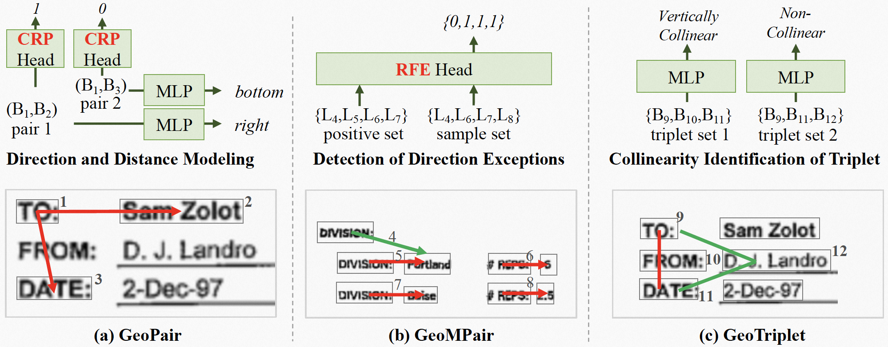

# GeoLayoutLM_infer

## Overview
GeoLayoutLM_infer is a project designed for [brief description of the project - e.g., document layout analysis, geographic information extraction, etc.]. This README provides guidance on how to prepare your data and do the Inference

## Table of Contents
- [Prerequisites](#prerequisites)
- [Data Preparation for Inference](#data-preparation-for-inference)
- [Usage](#usage)
- [Contributing](#contributing)


## Prerequisites
Before starting, ensure you have the following installed:
- Python (version- 3.10 or 3.11)
- Required packages (list packages and versions, e.g., TensorFlow, NumPy, etc.)
    ```bash
    pip install -r requirements_3.11.txt
    ```
- Access to the dataset (specify the dataset needed and how to obtain it)

## Data Preparation for Inference
First, navigate to the `preprocess/funsd_el` directory and run the following command to download the FUNSD dataset

```bash
cd path/to/GeoLayoutLM_infer/preprocess/funsd_el
```

### Follow these steps to download the FUNSD data, prepare the annotations.

```bash
python /preprocess/funsd_el/preprocess.py
```

### Follow these steps to prepare the annotations, and run inference on custom data.

### 1. Prepare Annotations
provide the path of 
ocr files and save loaction 
```
folder_path = '/media/ntlpt19/5250315B5031474F/geo_code_gpu/Geo_original_code/funsd_data/testing_funsd/OCR'
sv_path = '/media/ntlpt19/5250315B5031474F/geo_code_gpu/Geo_original_code/funsd_data/testing_funsd'

```
run file :
```bash
python annotation_data_prep.py
```

### 2. Organizing the Testing Data
Create a folder named `testing_data` in your project directory. Inside this folder, you need to have another directory named `images` and place the `annotations` , which is created by running the above file , need to place  inside `testing_data`. Your directory structure should look like this:

```

  ├─ testing_data/
  │  ├─ images/
  │  └─ annotations/
```

### 3. Running Preprocessing for Evaluation
Next, run the preprocessing script to prepare the evaluation data. Open `preprocess_eval.py` and modify the following configurations:

```python
CLASSES = ["O", "HEADER", "QUESTION", "ANSWER"]
CLASSES_VALID = ["HEADER", "QUESTION", "ANSWER"]
INPUT_PATH = "/media/ntlpt19/5250315B5031474F/geo_code_gpu/Geo_original_code/funsd_data/testing_funsd"
anno_dir = 'annotations'
OUTPUT_PATH = "/media/ntlpt19/5250315B5031474F/geo_code_gpu/Geo_original_code/funsd_data/testing_funsd/funsd_geo"
```

### 4. Generating Inference
Finally, run the inference script by executing:

```bash
python evaluate.py
```

You may need to adjust the configuration in `evaluate.py`. A sample configuration is provided below:


- **`dump_dir`**: Specify where you want to save the results.
  
  ```python
  dump_dir = "/media/ntlpt19/5250315B5031474F/geo_code_gpu/Geo_original_code/funsd_data/testing_funsd/funsd_data_linking"
  ```

- **`pretrained_best_type`**: Choose which model to use for inference. Options are `"linking"` or `"labeling"`.

  ```python
  pretrained_best_type = "linking"  # or "labeling"
  ```

- **`dataset_root_path`**: Provide the path where the processed files are located.

  ```python
  dataset_root_path = "/media/ntlpt19/5250315B5031474F/geo_code_gpu/Geo_original_code/funsd_data/testing_funsd/funsd_geo"
  ```

- **`workspace`**: Specify where the best models are located. The model path is constructed using:
  
  ```python
  workspace = "/media/ntlpt19/5250315B5031474F/geo_code_gpu/Geo_original_code/funsd_data"
  # Model path will be: workspace + 'checkpoints' + 'epoch=120<pretrained_best_type>.pt'
  ```

- **`n_classes`**: This should be calculated based on the number of classes in `CLASSES_VALID`. The formula is:

  ```python
  n_classes = len(CLASSES_VALID) * 2 + 1  # For 'O', which represents 'others'
  ```

Ensure to adjust other parameters accordingly. 

```python
val = {
    "batch_size": 1,
    "num_workers": 4,
    "limit_val_batches": 1.0,
    "dump_dir": "/media/ntlpt19/5250315B5031474F/geo_code_gpu/Geo_original_code/funsd_data/testing_funsd/funsd_data_linking",
    "pretrained_best_type": 'linking',  # Options include: 'labeling', 'linktesting'
    "n_classes": 4
},

workspace = "/media/ntlpt19/5250315B5031474F/geo_code_gpu/Geo_original_code/funsd_data",
dataset = "funsd",
dataset_root_path = "/media/ntlpt19/5250315B5031474F/geo_code_gpu/Geo_original_code/funsd_data/testing_funsd/funsd_geo",
n_classes = 7 
```


### Additional Notes
- Ensure that all paths are correctly set to point to your data directories.
- Modify the configurations based on your project requirements for optimal performance.
- we have testing these inference with out having the ground truth for linking as well as labeling
- In the `geolayoutlm_vie_module.py` file, changes have been made to include predictions for labeling used in linking. The original implementation is preserved in the `geolayoutlm_vie_module_org.py` file. If you face any challenges, you can refer to the original file for reference.

### . Further Improvements
- To enhance the quality of annotations and improve model performance, consider updating the `/preprocess/funsd_el/preprocess.py` script to implement data clustering. Each block of text should be assigned an ID, and 'text' need to have the block of text and under it need to have individual words. the structure for annotations should look like the following example:

```json
{
  "form": [
    {
      "text": "State Office Tower / 30 East Broad Street /    Columbus, Ohio 43215 -3428 www.ag.state.oh.us An Equal Opportunity Employer",
      "box": [182, 887, 539, 928],
      "linking": [],
      "label": "other",
      "words": [
        {
          "text": "State",
          "box": [182, 887, 209, 902]
        },
        {
          "text": "Office",
          "box": [211, 890, 240, 901]
        }
        ....
      ]
      "id": 0,
    }
     
  ]
}
```

- Maintaining annotations in this format during both training and inference will likely lead to improved results.
- samples result from above annotations:


- Currently we are Maintaining these kind of annotations , where, each word from the ocr treated as one block, the 'text' will be same as individual word

```
  "form": [
    {
      "box": [
        104,
        87,
        124,
        98
      ],
      "text": "ATT",
      "label": "other",
      "words": [
        {
          "box": [
            104,
            87,
            124,
            98
          ],
          "text": "ATT"
        }
      ],
      "linking": [],
      "id": 0
    }
```

- samples result from above annotations:


## Usage
Once the data is prepared, you can proceed with the inference tasks specified in the project documentation. For detailed usage instructions, refer to [link to usage instructions or tutorials].


# GeoLayoutLM: Geometric Pre-training for Visual Information Extraction
The official PyTorch implementation of GeoLayoutLM (CVPR 2023 highlight).

## Paper
- [CVPR 2023](https://openaccess.thecvf.com/content/CVPR2023/papers/Luo_GeoLayoutLM_Geometric_Pre-Training_for_Visual_Information_Extraction_CVPR_2023_paper.pdf)
- [arXiv](https://arxiv.org/abs/2304.10759)

GeoLayoutLM is a multi-modal framework for Visual Information Extraction (VIE, including SER and RE), which incorporates the novel **geometric pre-training**.
Additionally, novel **relation heads**, which are pre-trained by the geometric pre-training tasks and fine-tuned for RE, are designed to enrich and enhance the feature representation.
GeoLayoutLM achieves highly competitive scores in the SER task, and significantly outperforms the previous state-of-the-arts for RE.



<!--  -->
## Environment
The dependencies are listed in `requirements.txt`. Please install a proper torch version matching your cuda version first.
```
pip install -r requirements.txt
```

## Model Checkpoints
We released the pre-trained model for downstream fine-tuning.
Also, we provided SER and RE models fine-tuned on FUNSD.

|    | Pre-trained model | SER model | RE model |
|:--:|:-----------------:|:---------:|:--------:|
|Download|[LINK](https://github.com/AlibabaResearch/AdvancedLiterateMachinery/releases/download/v1.1.0-geolayoutlm-model/geolayoutlm_large_pretrain.pt)| [LINK](https://github.com/AlibabaResearch/AdvancedLiterateMachinery/releases/download/v1.1.0-geolayoutlm-model/epoch.105-f1_labeling.0.9232.pt) | [LINK](https://github.com/AlibabaResearch/AdvancedLiterateMachinery/releases/download/v1.1.0-geolayoutlm-model/epoch.182-f1_linking.0.8923.pt) |
| F1 | - | 92.32 | 89.23 |

Note that the training with the vision module causes unstable final performance, i.e., multiple independent experiments will have diffenrent F1 scores.

## Fine-tuning
### Preprocess the data
- FUNSD

[FUNSD](https://guillaumejaume.github.io/FUNSD/) is a dataset for form understanding. It is widely used in the VIE task.
```
cd preprocess/funsd_el/
python preprocess.py
```

### Fine-tune and Evaluate
```
CUDA_VISIBLE_DEVICES=0 python train.py --config=configs/finetune_funsd.yaml
CUDA_VISIBLE_DEVICES=0 python evaluate.py --config=configs/finetune_funsd.yaml [--pretrained_model_file=path/to/xx.pt]
```

## Multi-lingual base model
We also released a base model pre-trained on Chinese and English documents.
Refer to [modelscope](https://www.modelscope.cn/models/damo/multi-modal_convnext-roberta-base_vldoc-embedding/summary) for more details.

## Acknowledgments
We implemented the fine-tuning based on the code of [BROS](https://github.com/clovaai/bros).

## Citation
Please cite our paper if the work helps you.
```
@article{cvpr2023geolayoutlm,
  title={GeoLayoutLM: Geometric Pre-training for Visual Information Extraction},
  author={Chuwei Luo and Changxu Cheng and Qi Zheng and Cong Yao},
  journal={2023 IEEE/CVF Conference on Computer Vision and Pattern Recognition (CVPR)},
  year={2023}
}
```

## License
```
Copyright 2023-present Alibaba Group.

Licensed under the Apache License, Version 2.0 (the "License");
you may not use this file except in compliance with the License.
You may obtain a copy of the License at

    http://www.apache.org/licenses/LICENSE-2.0

Unless required by applicable law or agreed to in writing, software
distributed under the License is distributed on an "AS IS" BASIS,
WITHOUT WARRANTIES OR CONDITIONS OF ANY KIND, either express or implied.
See the License for the specific language governing permissions and
limitations under the License.
```
